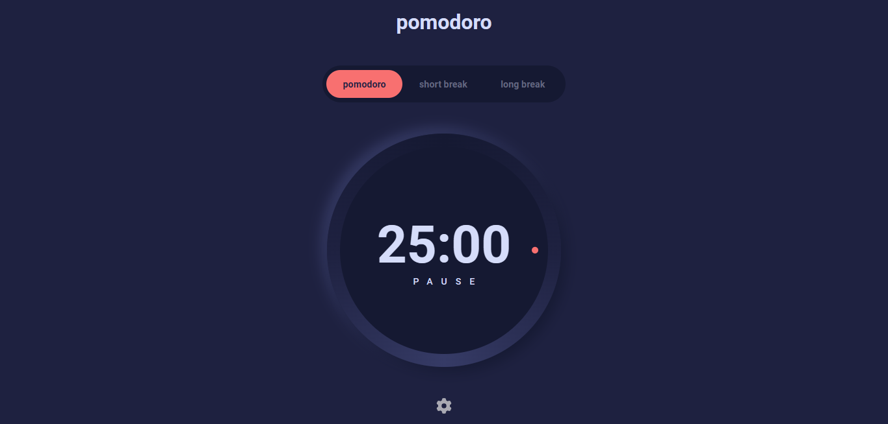
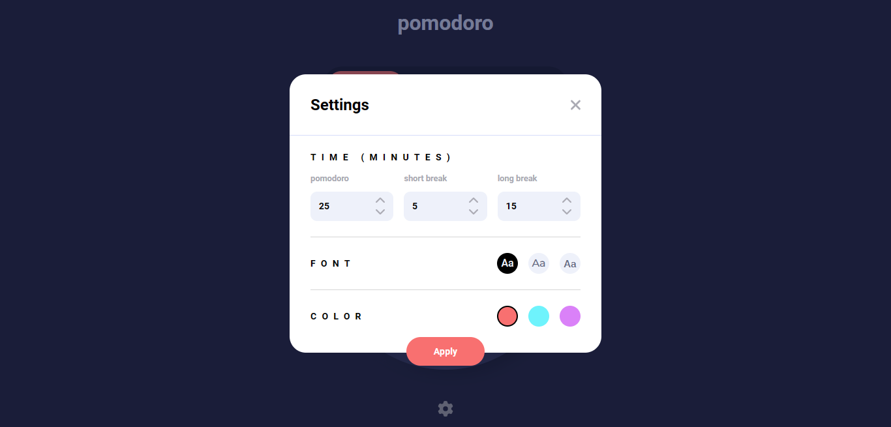
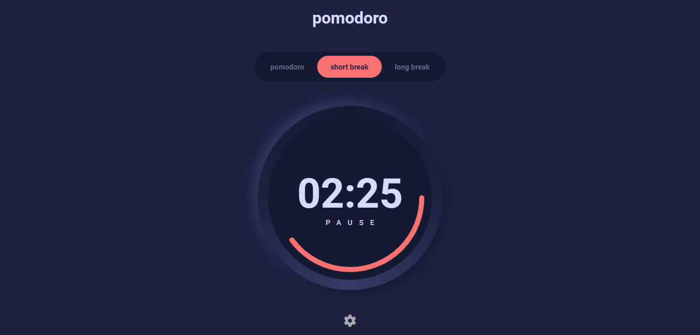
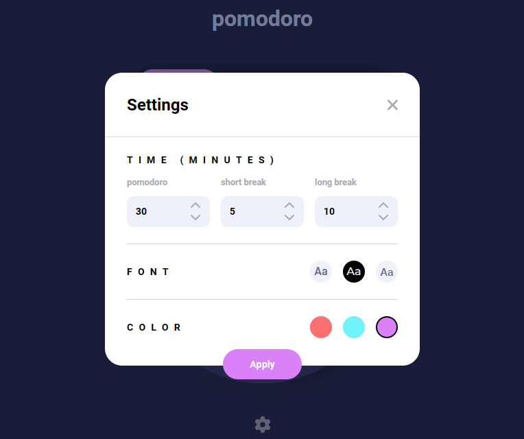
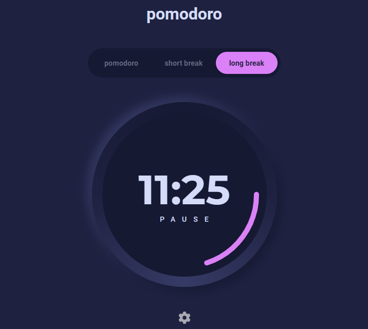
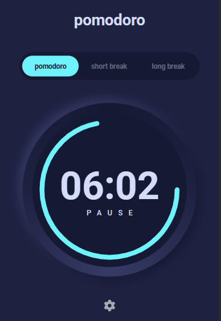
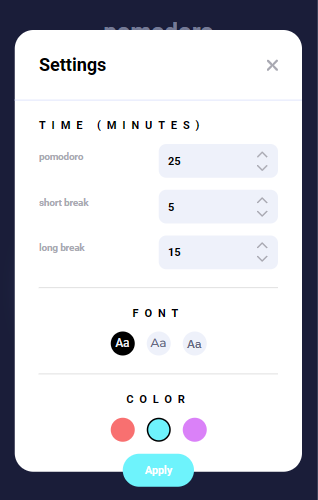

# Frontend Mentor - Pomodoro Timer App solution

This is a solution to the [Pomodoro Timer App challenge on Frontend Mentor](https://www.frontendmentor.io/challenges/pomodoro-app-KBFnycJ6G).

## Table of contents

- [The challenge](#the-challenge)
- [Built with](#built-with)
- [What I learned](#what-i-learned)
- [Useful resources](#useful-resources)
- [Screenshots](#screenshots)

### The challenge

Users should be able to:

- Set a Pomodoro timer and short & long break timers (x-minutes stretches of focused work broken by y-minute breaks. Longer breaks are taken after four consecutive work intervals (pomodoro))
- Customize how long each timer runs for
- See a circular progress bar that *updates every minute* and represents how far through their timer they are
- Customize the appearance of the app with the ability to set preferences for colors and fonts
- View the optimal layout for the site depending on their device's screen size

### Built with

- Semantic HTML5 markup
- CSS custom properties
- Flexbox
- Desktop-first workflow
- SVG images
- Media Queries
- Vanilla JavaScript ES6+

### What I learned

#### - SVG <circle> element

#### - How conic gradients work

#### - How to change the fill color of an SVG element
  (A) General Approach
    (1) Embedding the SVG code into the HTML;
    (2) Changing the fill property to fill="currentColor";
    (3) Edit the color of the svg path, using the CSS color property (yes, the same that is used to change the font color).

  (B) 
    (1) Embedding the SVG code into the HTML;
    (2) Directly editing the fill property of the embedded SVG code to the desired color (fill="#a9a9b2", for example).
  
  (C)
    (1) Adding the SVG using an  tag;
    (2) Open the SVG file and changing the fill property.
  
  (D)
    (1) Adding the SVG using an  tag;
    (2) Applying a filter to convert the original SVG color to the desired one (There's always a loss).
  
#### - stroke Properties
    - stroke
    - stroke-width
    - stroke-linecap
    - stroke-dasharray
    - stroke-dashoffset

#### - How viewBox works
    

### Useful resources

- [SVG <circle>](https://www.w3schools.com/graphics/svg_circle.asp)

- [CSS Conic Gradients](https://www.w3schools.com/css/css3_gradients_conic.asp)

- [How to change the color of an SVG element](https://stackoverflow.com/questions/22252472/how-can-i-change-the-color-of-an-svg-element)

- [stroke, stroke-width & stroke-linecap](https://www.w3schools.com/graphics/svg_stroking.asp)
- [stroke-dasharray](https://css-tricks.com/almanac/properties/s/stroke-dasharray/)
- [stroke-dashoffset](https://css-tricks.com/almanac/properties/s/stroke-dashoffset/)

- [viewBox](https://css-tricks.com/scale-svg/)

### Screenshots

